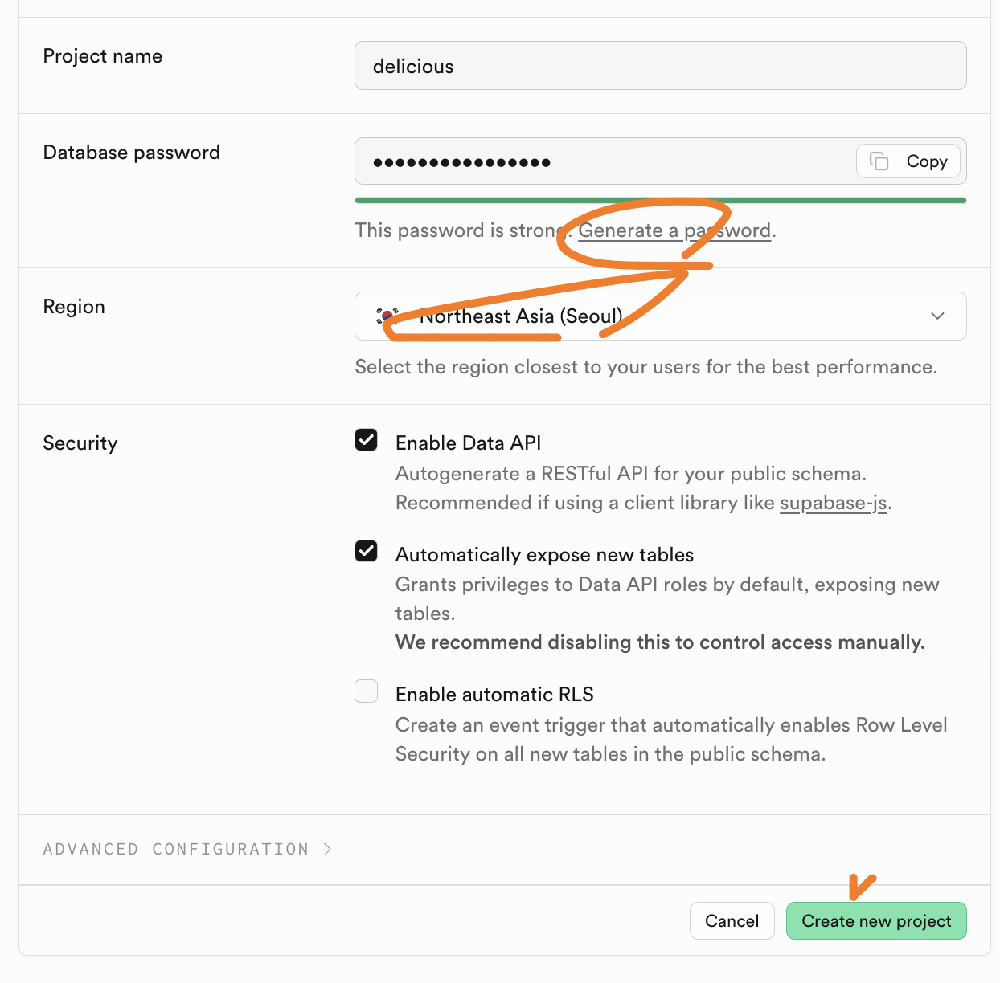
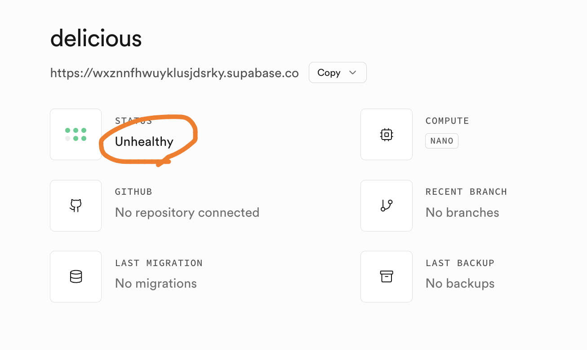
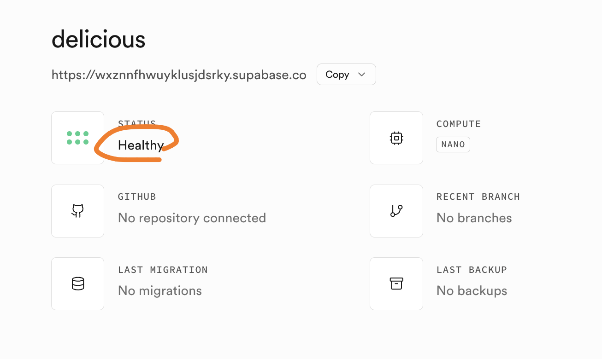
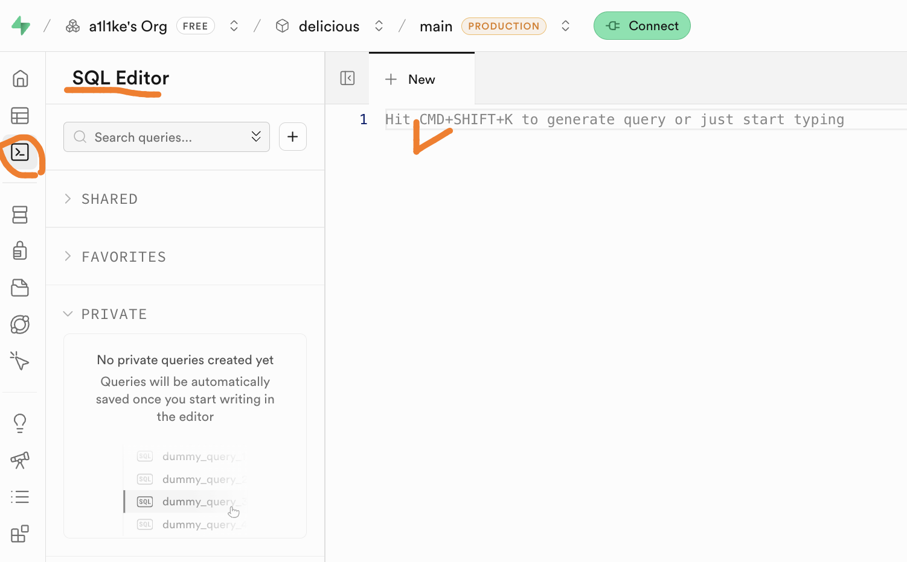
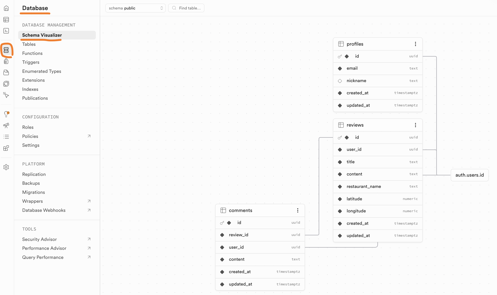
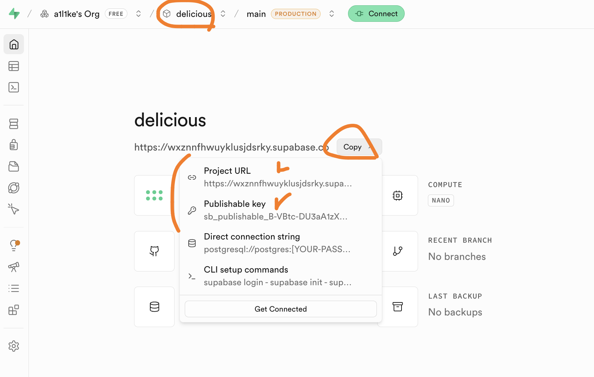

# Supabase 설정

## 1. 프로젝트 생성

- Supabase에 접속한다.
  - https://supabase.com/

- `Project name`에는 원하는 프로젝트 이름을 입력한다.
  - 예시: `delicious`
- `Database password`는 `Generate a password`로 생성한다.
- `Region`은 `Northeast Asia (Seoul)`로 선택한다.
- `Create new project`를 클릭해 프로젝트를 생성한다.

## 2. 프로젝트 상태 확인

- 프로젝트 생성 직후에는 상태가 `Unhealthy`로 보일 수 있다.
- 잠시 기다린 뒤 프로젝트 상태를 다시 확인한다.

- 상태가 `Healthy`로 바뀌면 다음 단계로 진행한다.

## 3. SQL 스키마 실행

- 왼쪽 메뉴에서 `SQL Editor`를 연다.
- `./supabase/schemas` 디렉터리에 있는 SQL 파일을 번호 순서대로 실행한다.

## 4. 스키마 확인

- 왼쪽 메뉴에서 `Database`를 선택한다.
- `Schema Visualizer`에서 `profiles`, `reviews`, `comments` 테이블이 생성됐는지 확인한다.

## 5. API 정보 확인

- 상단의 프로젝트 이름이 `delicious`인지 확인한다.
- `Copy` 메뉴에서 `Project URL`을 복사해 프런트엔드 설정에 사용한다.
- `Copy` 메뉴에서 `Publishable key`를 복사해 프런트엔드 설정에 사용한다.
