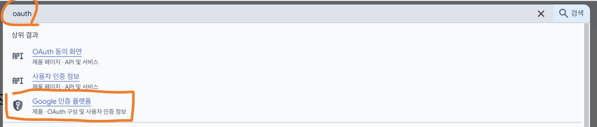
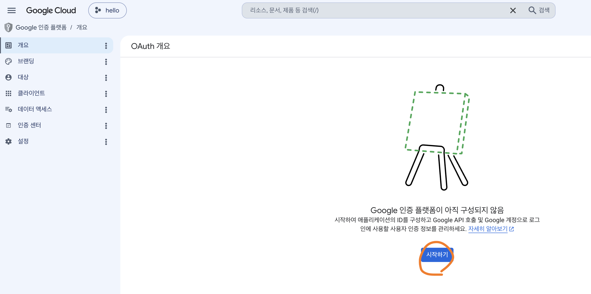
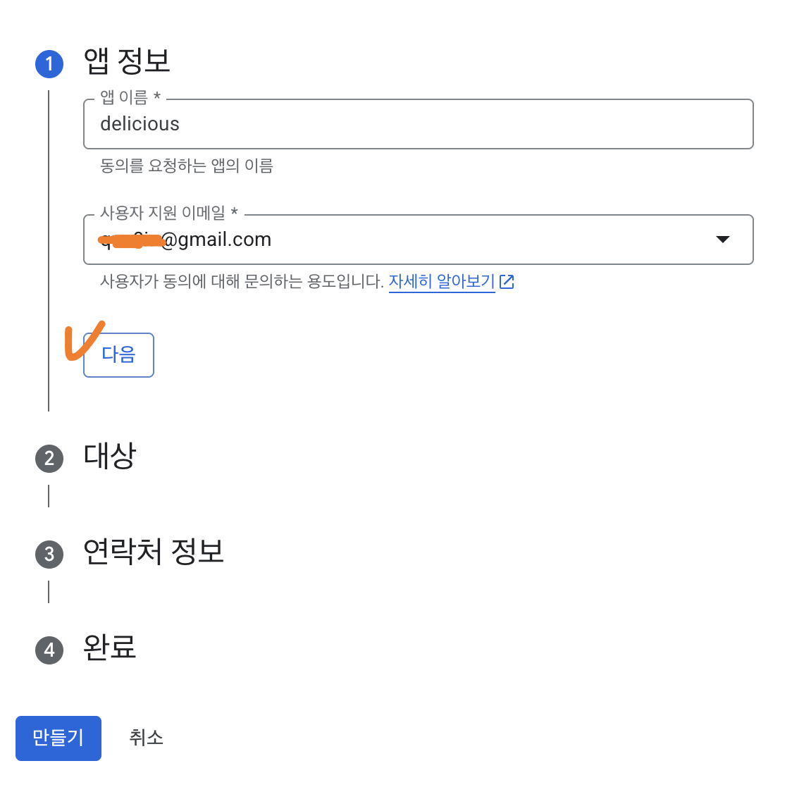
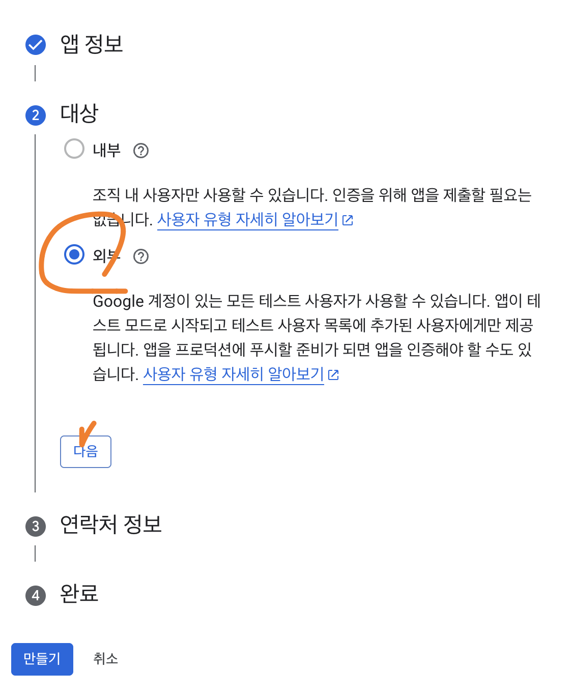
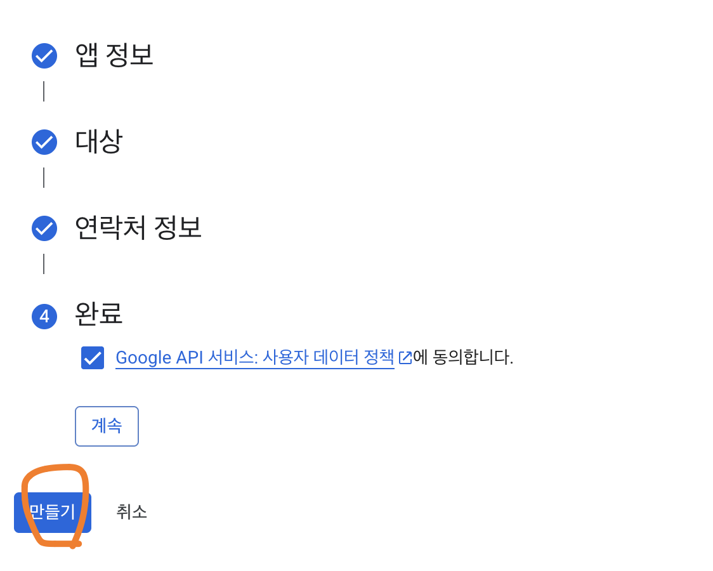
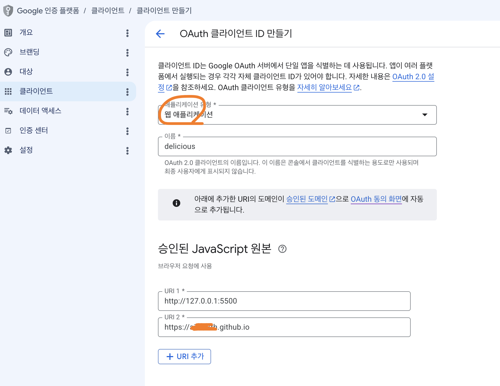
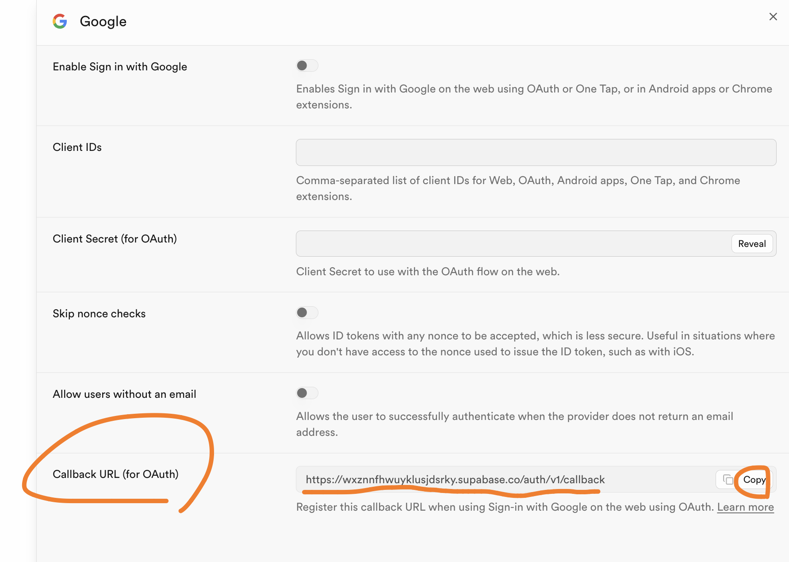
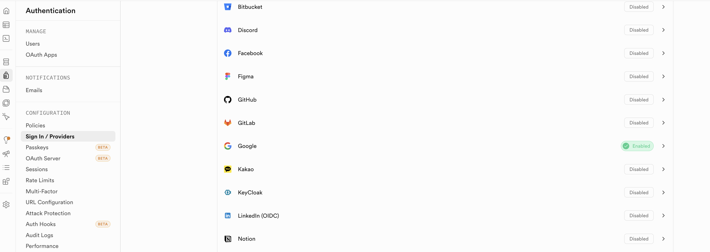

# 소셜 로그인 설정 (Google)

## 1. 사용할 Provider 확인

- Supabase 프로젝트의 왼쪽 메뉴에서 `Authentication`을 연다.
- `Sign In / Providers` 목록에서 사용할 `Google`, `Kakao`를 확인한다.
- 이 문서에서는 먼저 `Google` 로그인을 설정한다.

## 2. Google Cloud Console에서 인증 플랫폼 찾기

- Google Cloud Console에 접속한다.
  - https://console.cloud.google.com/
- 검색창에 `oauth`를 입력해 검색 결과에서 `Google 인증 플랫폼`을 클릭한다.

## 3. OAuth 동의 화면 시작하기

- `Google 인증 플랫폼이 아직 구성되지 않음` 화면에서 `시작하기`를 클릭한다.

## 4. 앱 정보 입력

- `앱 이름`에 `delicious`를 입력한다.
- `사용자 지원 이메일`에 본인의 이메일을 선택한다.
- `다음`을 클릭한다.

## 5. 대상 선택

- `대상`에서 `외부`를 선택한다.
- `다음`을 클릭한다.

## 6. 연락처 정보 입력

- `연락처 정보`에 알림을 받을 이메일 주소를 입력한다.
- `다음`을 클릭한다.

## 7. 약관 동의 후 생성

- `Google API 서비스: 사용자 데이터 정책에 동의합니다`에 체크한다.
- `만들기`를 클릭한다.

## 8. OAuth 클라이언트 만들기

- `OAuth 클라이언트 만들기`를 클릭한다.

## 9. OAuth 클라이언트 정보 입력

- `애플리케이션 유형`은 `웹 애플리케이션`을 선택한다.
- `이름`에 `delicious`를 입력한다.
- `승인된 자바스크립트 원본`에 다음 URI를 추가한다.
  - 로컬 개발 서버 주소 (예시: `http://127.0.0.1:5500`)
  - GitHub Pages 주소 (예시: `https://{GitHub 아이디}.github.io`)

## 10. Supabase에서 콜백 URL 복사

- Supabase의 `Authentication` > `Sign In / Providers`에서 `Google`을 연다.
- `Callback URL (for OAuth)`을 복사한다.

## 11. 승인된 리디렉션 URI 등록

- `승인된 리디렉션 URI`의 `URI 1`에 복사해 둔 콜백 URL을 붙여넣는다.
- `만들기`를 클릭한다.

## 12. 클라이언트 ID와 보안 비밀번호 확인

- `클라이언트 ID`와 `클라이언트 보안 비밀번호`를 복사해 둔다.
  - 대화상자를 닫으면 비밀번호를 다시 확인할 수 없으므로 미리 안전한 곳에 보관한다.

## 13. Supabase에 클라이언트 정보 입력

- `Enable Sign in with Google`을 활성화한다.
- `Client IDs`에 복사해 둔 클라이언트 ID를 입력한다.
- `Client Secret (for OAuth)`에 복사해 둔 클라이언트 보안 비밀번호를 입력한다.
- `Save`를 클릭한다.

## 14. 앱 게시

- Google 인증 플랫폼의 `대상` 메뉴에서 `앱 게시`를 클릭한다.

## 15. 프로덕션 전환 확인

- `프로덕션으로 푸시하시겠어요?` 대화상자에서 `확인`을 클릭한다.

## 16. Provider 활성화 확인

- Supabase의 `Sign In / Providers` 목록에서 `Google`이 `Enabled` 상태로 바뀐 것을 확인한다.

# 소셜 로그인 설정 (Kakao)
