# 소셜 로그인 설정 (Google)

## 1. 사용할 Provider 확인

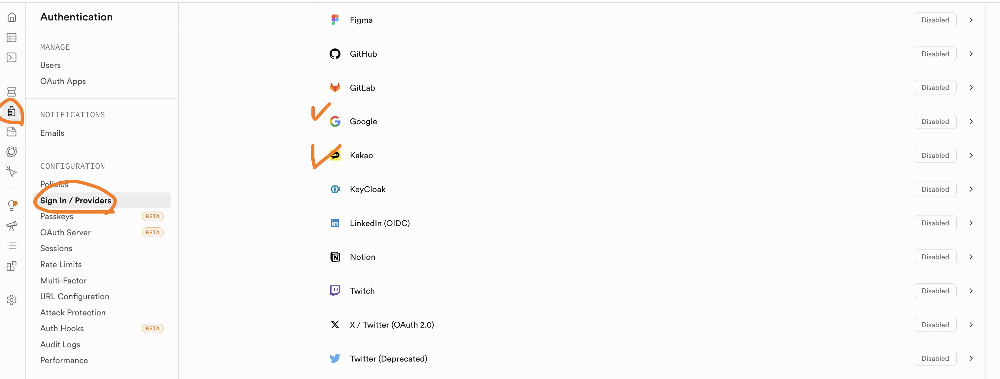

- Supabase 프로젝트의 왼쪽 메뉴에서 `Authentication`을 연다.
- `Sign In / Providers` 목록에서 사용할 `Google`, `Kakao`를 확인한다.
- 이 문서에서는 먼저 `Google` 로그인을 설정한다.

## 2. Google Cloud Console에서 인증 플랫폼 찾기

- Google Cloud Console에 접속한다.
  - https://console.cloud.google.com/
- 검색창에 `oauth`를 입력해 검색 결과에서 `Google 인증 플랫폼`을 클릭한다.

## 3. OAuth 동의 화면 시작하기

- `Google 인증 플랫폼이 아직 구성되지 않음` 화면에서 `시작하기`를 클릭한다.

## 4. 앱 정보 입력

- `앱 이름`에 `delicious`를 입력한다.
- `사용자 지원 이메일`에 본인의 이메일을 선택한다.
- `다음`을 클릭한다.

## 5. 대상 선택

- `대상`에서 `외부`를 선택한다.
- `다음`을 클릭한다.

## 6. 연락처 정보 입력

- `연락처 정보`에 알림을 받을 이메일 주소를 입력한다.
- `다음`을 클릭한다.

## 7. 약관 동의 후 생성

- `Google API 서비스: 사용자 데이터 정책에 동의합니다`에 체크한다.
- `만들기`를 클릭한다.

## 8. OAuth 클라이언트 만들기

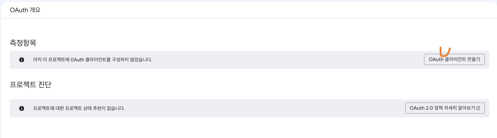

- `OAuth 클라이언트 만들기`를 클릭한다.

## 9. OAuth 클라이언트 정보 입력

- `애플리케이션 유형`은 `웹 애플리케이션`을 선택한다.
- `이름`에 `delicious`를 입력한다.
- `승인된 자바스크립트 원본`에 다음 URI를 추가한다.
  - 로컬 개발 서버 주소 (예시: `http://127.0.0.1:5500`)
  - GitHub Pages 주소 (예시: `https://{GitHub 아이디}.github.io`)

## 10. Supabase에서 콜백 URL 복사

- Supabase의 `Authentication` > `Sign In / Providers`에서 `Google`을 연다.
- `Callback URL (for OAuth)`을 복사한다.

## 11. 승인된 리디렉션 URI 등록

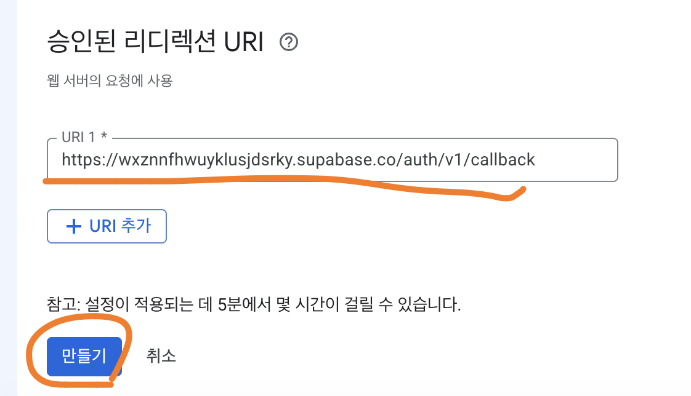

- `승인된 리디렉션 URI`의 `URI 1`에 복사해 둔 콜백 URL을 붙여넣는다.
- `만들기`를 클릭한다.

## 12. 클라이언트 ID와 보안 비밀번호 확인

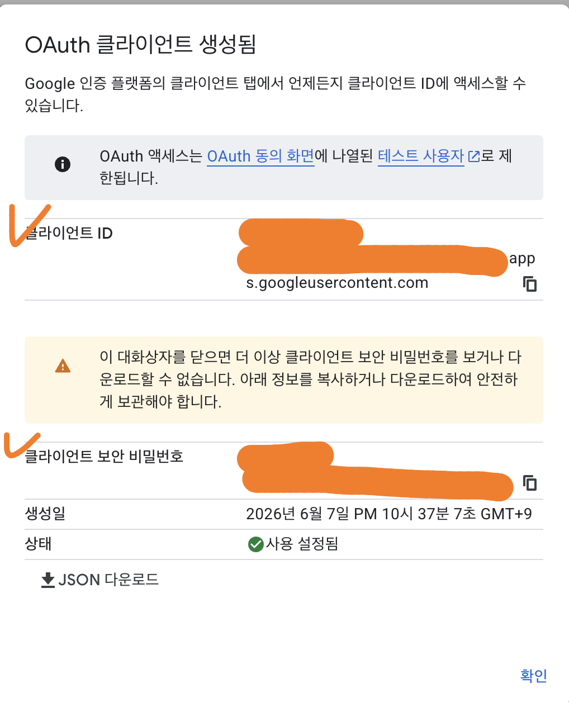

- `클라이언트 ID`와 `클라이언트 보안 비밀번호`를 복사해 둔다.
  - 대화상자를 닫으면 비밀번호를 다시 확인할 수 없으므로 미리 안전한 곳에 보관한다.

## 13. Supabase에 클라이언트 정보 입력

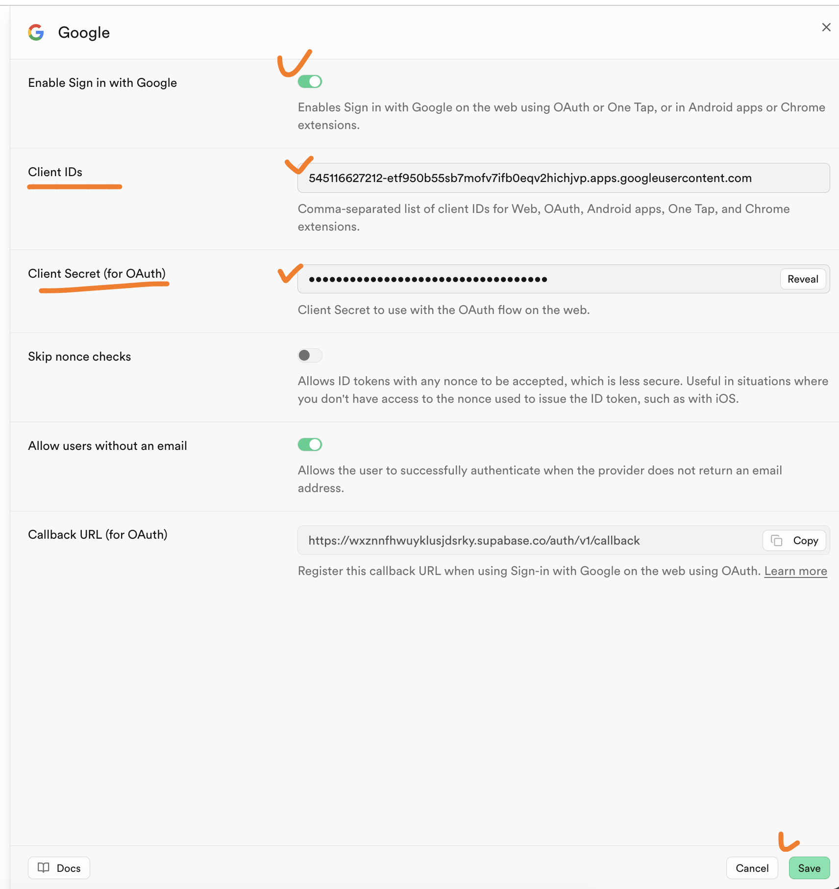

- `Enable Sign in with Google`을 활성화한다.
- `Client IDs`에 복사해 둔 클라이언트 ID를 입력한다.
- `Client Secret (for OAuth)`에 복사해 둔 클라이언트 보안 비밀번호를 입력한다.
- `Save`를 클릭한다.

## 14. 앱 게시

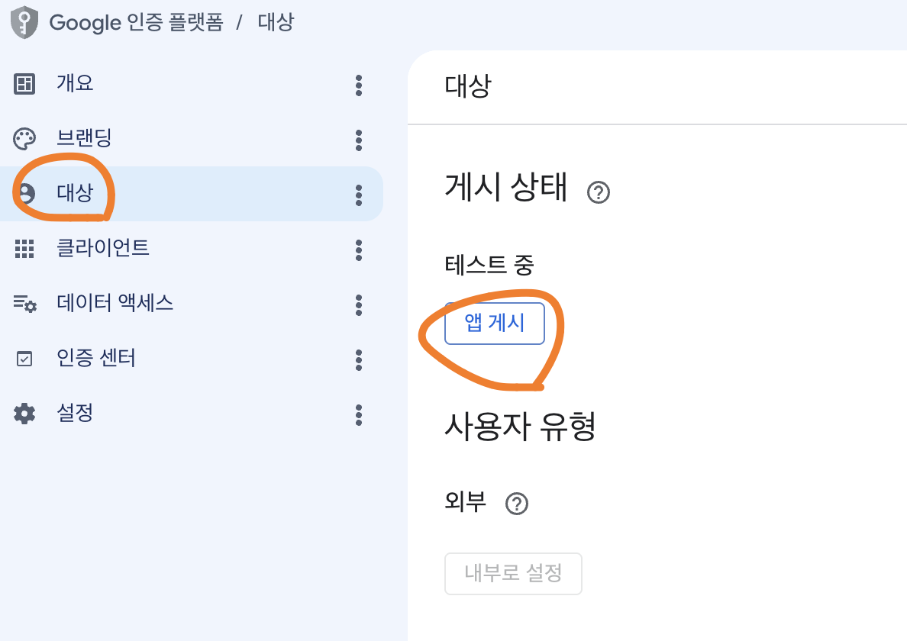

- Google 인증 플랫폼의 `대상` 메뉴에서 `앱 게시`를 클릭한다.

## 15. 프로덕션 전환 확인

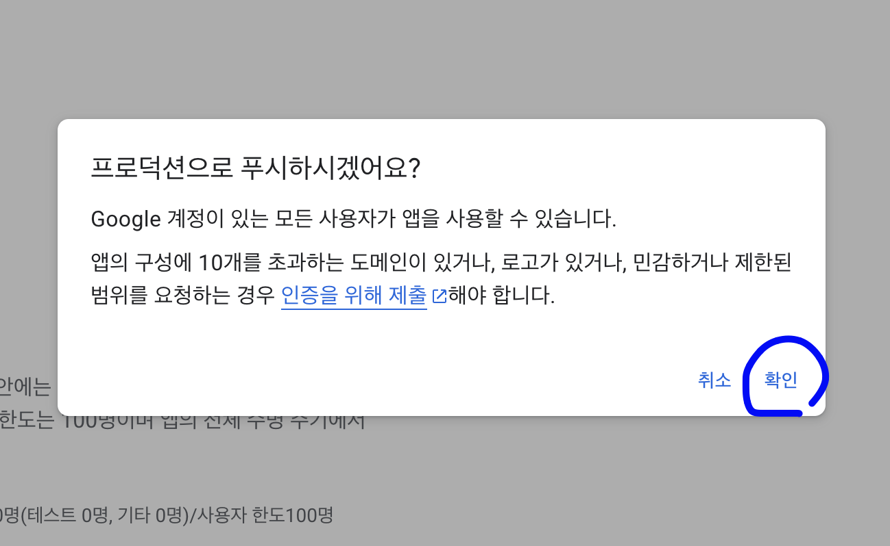

- `프로덕션으로 푸시하시겠어요?` 대화상자에서 `확인`을 클릭한다.

## 16. Provider 활성화 확인

- Supabase의 `Sign In / Providers` 목록에서 `Google`이 `Enabled` 상태로 바뀐 것을 확인한다.

# 소셜 로그인 설정 (Kakao)

- Kakao는 Supabase 내장 provider 대신 `Custom OIDC Provider`로 연동한다.
  - Supabase 내장 Kakao provider는 `account_email` 등 동의 항목이 하드코딩되어 있어 클라이언트에서 제거할 수 없고, 이메일을 받으려면 비즈앱 신청이 필요하다.
  - 그래서 `openid` scope만 요청하는 Custom Provider로 등록한다. 이메일이 필요하면 가입 폼에서 직접 입력받는 방식을 권장한다.

## 1. Kakao Developers에서 앱 생성

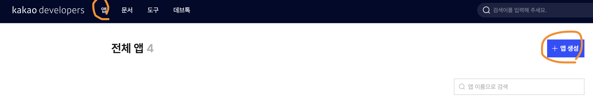

- Kakao Developers에 접속한다.
  - https://developers.kakao.com/
- 상단 `앱` 메뉴에서 `앱 생성`을 클릭한다.

## 2. 앱 정보 입력

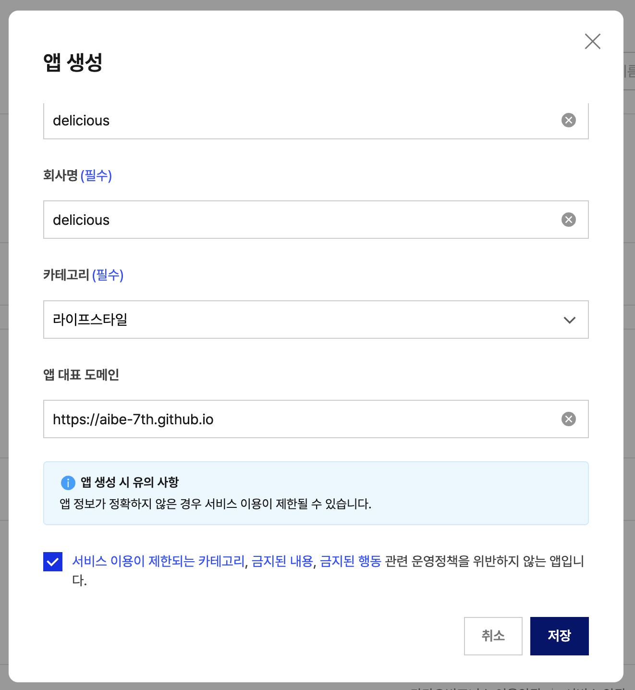

- `앱 이름`과 `회사명`에 `delicious`를 입력한다.
- `카테고리`는 `라이프스타일`을 선택한다.
- `앱 대표 도메인`에 GitHub Pages 주소를 입력한다 (예시: `https://{GitHub 아이디}.github.io`).
- 운영정책을 위반하지 않는다는 항목에 체크한 뒤 `저장`을 클릭한다.

## 3. 카카오 로그인과 OpenID Connect 활성화

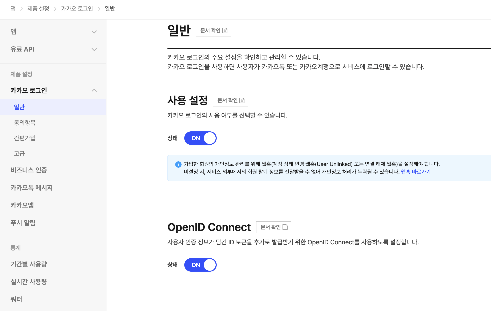

- 왼쪽 메뉴에서 `제품 설정` > `카카오 로그인` > `일반`을 연다.
- `사용 설정`의 `상태`를 `ON`으로 바꾼다.
- `OpenID Connect`의 `상태`를 `ON`으로 바꾼다.
  - Custom Provider가 `openid` scope를 사용하므로 OpenID Connect 활성화가 필수이다.

## 4. REST API 키 확인 (Client ID)

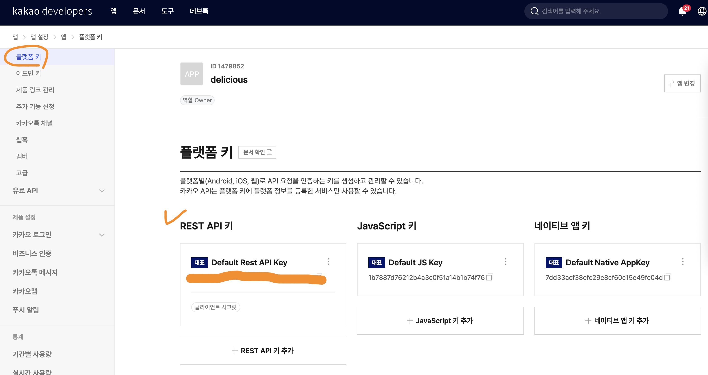

- 왼쪽 메뉴에서 `앱 설정` > `플랫폼 키`를 연다.
- `REST API 키`의 `Default Rest API Key`가 Supabase에 입력할 `Client ID`이다.

## 5. 클라이언트 시크릿 발급 (Client Secret)

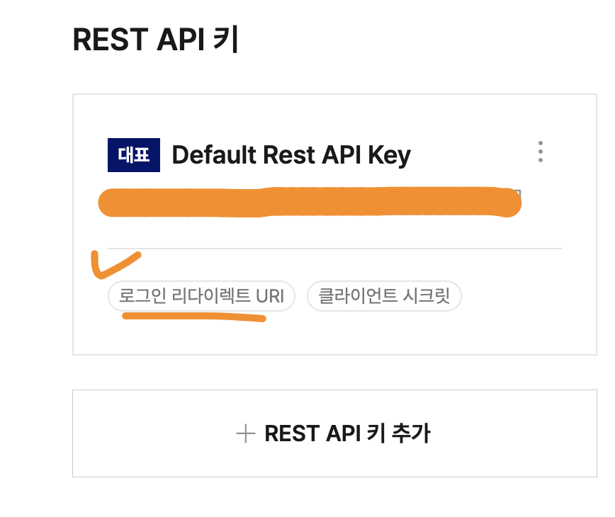

- `REST API 키` 카드에서 `클라이언트 시크릿`을 클릭한다.

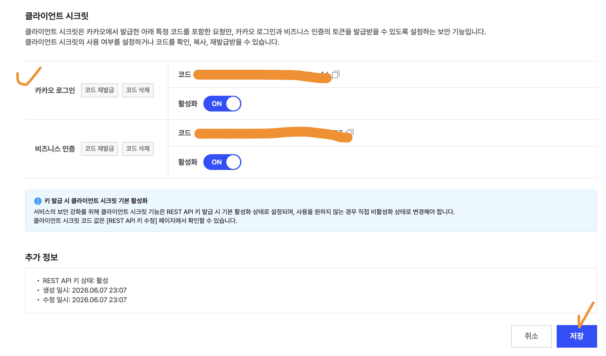

- `카카오 로그인`의 `코드`를 `활성화`(`ON`)하고 `저장`한다.
- 발급된 코드가 Supabase에 입력할 `Client Secret`이다.

## 6. Supabase에서 Custom Provider 생성 시작

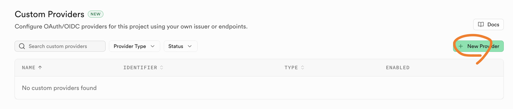

- Supabase의 `Authentication` > `Sign In / Providers`에서 `Custom Providers`의 `New Provider`를 클릭한다.

## 7. Custom Provider 정보 입력과 Callback URL 복사

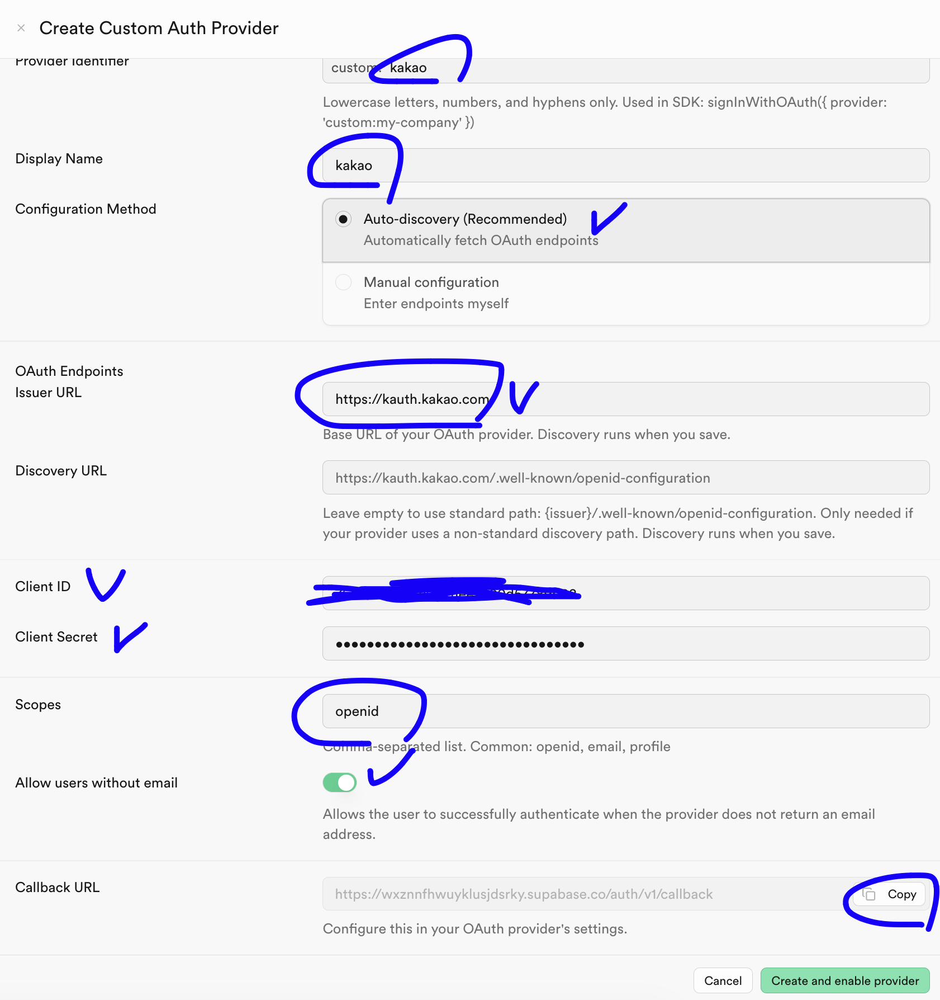

- 다음 값을 입력한다.
  - `Provider Identifier`: `kakao` (SDK에서는 `custom:kakao`로 사용됨)
  - `Display Name`: `kakao`
  - `Configuration Method`: `Auto-discovery (OIDC)`
  - `Issuer URL`: `https://kauth.kakao.com`
  - `Discovery URL`: 비워 둔다 (표준 경로라 자동으로 찾는다)
  - `Client ID`: 4단계에서 확인한 REST API 키
  - `Client Secret`: 5단계에서 발급한 클라이언트 시크릿
  - `Scopes`: `openid`
  - `Allow users without email`: `ON` (이메일을 받지 않으므로 필수)
- 하단의 `Callback URL`을 `Copy`로 복사한다.

## 8. 카카오 로그인 리다이렉트 URI 등록

- Kakao Developers의 `REST API 키` 카드에서 `로그인 리다이렉트 URI`를 클릭한다.

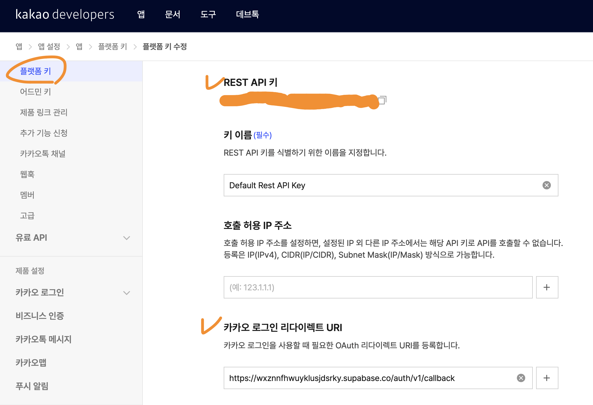

- `카카오 로그인 리다이렉트 URI`에 7단계에서 복사한 Supabase `Callback URL`을 입력하고 저장한다.

## 9. Custom Provider 생성 완료

- Supabase의 Custom Provider 입력 화면으로 돌아와 `Create and enable provider`를 클릭한다.
- `Custom Providers` 목록에 `custom:kakao`가 `Enabled` 상태로 추가된 것을 확인한다.

## 10. 프런트엔드에서 사용

- 소셜 로그인 버튼의 `data-provider`를 `custom:kakao`로 지정한다.
  - Supabase 대시보드에 등록한 식별자와 정확히 일치해야 한다.

# 리다이렉트 URL 설정 (배포 공통)

- Google·Kakao 모두에 적용되는 공통 설정이다.
- 프런트엔드는 현재 접속한 주소를 기준으로 로그인 후 돌아올 `redirectTo`를 자동으로 만들어 Supabase에 전달한다 (`docs/js/social-auth.js`). 따라서 코드는 수정할 필요가 없다.
- 단, Supabase는 전달받은 `redirectTo`가 **허용 목록에 있을 때만** 사용한다. 목록에 없으면 이를 무시하고 기본 `Site URL`(기본값 `http://localhost:3000`)로 폴백한다.
  - 배포 후에도 자꾸 `localhost:3000`으로 리다이렉트된다면 이 설정이 누락된 경우다.

## 1. URL Configuration 열기

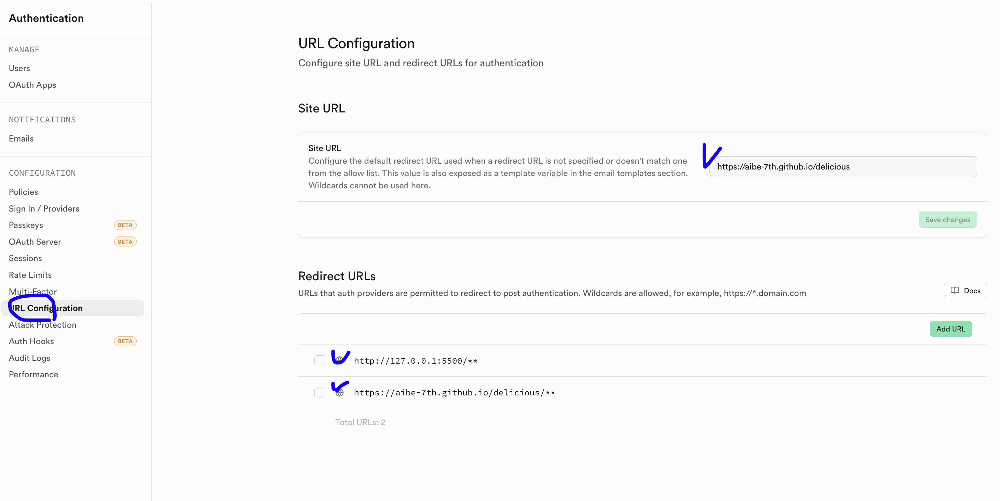

- Supabase의 `Authentication` > `URL Configuration`을 연다.

## 2. Site URL 설정

- `Site URL`에 배포 주소를 입력한다.
  - 예시: `https://{GitHub 아이디}.github.io/delicious/`

## 3. Redirect URLs 등록

- `Redirect URLs`에 다음 주소를 추가한다. 하위 경로와 쿼리스트링(`?code=...`)까지 허용하도록 끝에 `**`를 붙인다.
  - GitHub Pages 주소: `https://{GitHub 아이디}.github.io/delicious/**`
  - 로컬 개발 서버 주소(선택): `http://127.0.0.1:5500/**`, `http://localhost:5500/**`
- `Save`를 클릭한다.
