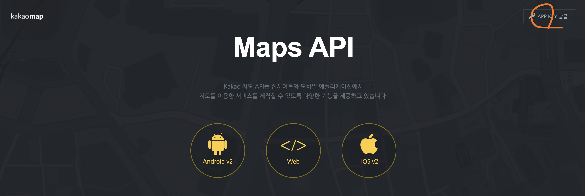
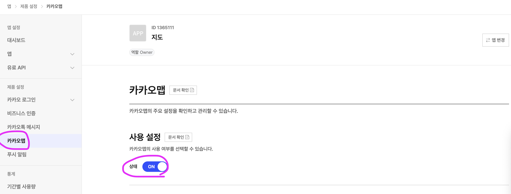
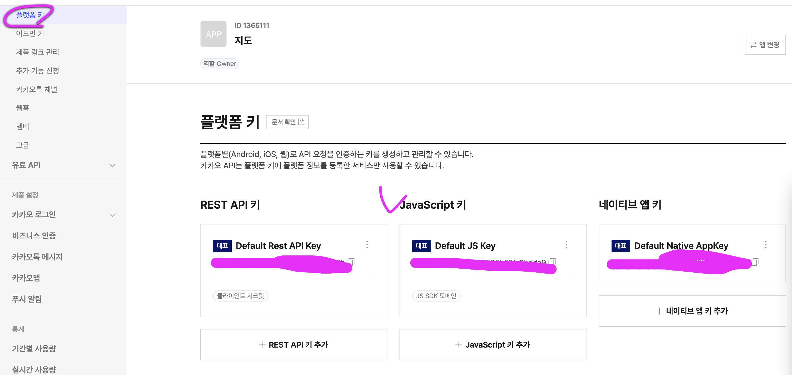
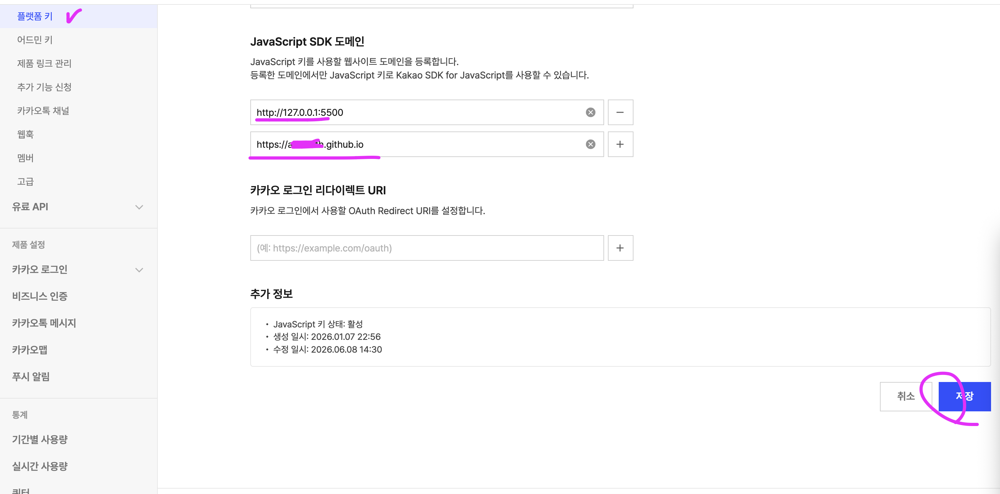

# 지도 검색 설정 (Naver Maps / Kakao Maps)

- 게시글 작성 화면에서 네이버 지도 또는 카카오 지도를 선택해 장소를 검색하고 위도·경도를 자동 입력한다.
- 네이버는 도로명·지번 주소 검색 중심이고, 카카오는 상호명·주소 키워드 검색에 사용한다.
- 정적 호스팅(GitHub Pages)에서는 Client Secret이 필요한 네이버 지역검색 REST API를 브라우저에서 직접 호출하지 않는다.
- 현재 네이버 구현은 **네이버 지도 JS SDK의 Geocoding**을 사용한다.
  - SDK는 `ncpKeyId`와 NCP 콘솔에 등록한 Web 서비스 URL로 인증한다.
  - Client Secret과 `X-NCP-APIGW-API-KEY` 헤더는 사용하지 않는다.
- 현재 카카오 구현은 **카카오 지도 JavaScript API의 services 라이브러리**를 사용한다.
  - SDK는 JavaScript 키와 Kakao Developers에 등록한 Web 도메인으로 인증한다.
  - REST API 키와 Admin 키는 사용하지 않는다.
- 검색 provider는 `docs/js/place-search.js`에 모아 두어, provider 추가·교체 시 작성 화면 로직 변경을 최소화한다.

# 네이버 지도 설정

## 1. NAVER Cloud Platform 접속


- NAVER Cloud Platform에 접속해 로그인한다.
  - https://www.ncloud.com/
- 우측 상단 `콘솔`을 클릭한다.
- 콘솔 진입 후 상단 검색창에서 `Maps`를 검색한다.

## 2. Maps Application 열기


- `Services` > `Application Services` > `Maps`로 이동한다.
- 좌측 메뉴에서 `Application`이 선택되어 있는지 확인한다.
- `Application 등록` 버튼을 클릭한다.

## 3. Application 등록


- `Application 이름`에 프로젝트를 구분할 이름을 입력한다.
  - 예시: `delicious`
- `API 선택`에서 현재 구현에 필요한 항목을 선택한다.
  - `Dynamic Map`: 작성 화면 미리보기 지도와 목록 카드 지도 표시
  - `Geocoding`: 도로명·지번 주소를 위도·경도로 변환
  - `Reverse Geocoding`: 목록 지도 정보창에 좌표 → 주소를 표시 (선택, 미선택 시 이름만 표시)
- `Static Map`, `Directions` 등은 현재 구현에서 사용하지 않는다.
- `Web 서비스 URL`에 실제 접속 주소를 추가한다.
  - GitHub Pages 예시: `https://{GitHub 아이디}.github.io/delicious`
  - 로컬 예시: `http://127.0.0.1:5500/docs`
  - `localhost`로 테스트한다면 `http://localhost:5500/docs`도 함께 추가한다.
- 등록하지 않은 주소에서는 SDK 인증이 실패하므로 배포 주소와 로컬 테스트 주소를 모두 넣는다.
- `등록` 버튼을 클릭한다.

## 4. API 사용 상태 확인


- 등록이 끝나면 Application 목록에서 방금 만든 항목을 선택한다.
- `API 관리`의 `인증 정보` 탭에서 `Dynamic Map`과 `Geocoding`이 보이는지 확인한다.
- 사용량이 0으로 표시되어도 설정 자체는 정상이다. 실제 작성 화면에서 검색하면 사용량이 반영된다.

## 5. Client ID 복사


- `인증 정보` 창을 열어 `Client ID (X-NCP-APIGW-API-KEY-ID)`를 복사한다.
- `Client Secret (X-NCP-APIGW-API-KEY)`는 복사하지 않는다.
  - 현재 브라우저 구현에서는 Secret을 사용하지 않는다.
  - Secret은 외부 서버에서 REST API를 호출할 때만 필요하다.

## 6. 프로젝트 설정 반영

- `docs/js/config.js`의 `NAVER_MAP_CLIENT_ID`에 복사한 Client ID를 입력한다.

```js
export const NAVER_MAP_CLIENT_ID = "여기에_Client_ID";
```

- 네이버 키가 비어 있으면 작성 화면에서 `네이버 지도` 선택지만 비활성화된다.

## 7. 작성 화면 동작 확인

- `docs/write.html`에서 `네이버 지도`를 선택하고 `장소 검색` 입력창에 도로명·지번 주소를 입력한다.
  - 예시: `서울특별시 중구 세종대로 110`
- `검색` 버튼을 클릭하거나 입력창에서 Enter를 누른다.
- 검색 결과를 선택하면 다음이 자동 반영된다.
  - 위도·경도: 폼의 hidden 필드에 저장 (화면에는 노출하지 않음)
  - `상호명`: 주소에 건물명 정보가 있고 상호명 입력칸이 비어 있을 때만 자동 입력 (대부분 직접 입력)
- 선택한 위치는 `Dynamic Map`으로 미리보기 지도에 표시된다.
- 지도 렌더링에 실패해도 저장 흐름은 막지 않고 미리보기만 숨긴다.
- 목록(`docs/index.html`)에서는 상호명·좌표를 본문에 노출하지 않고, 카드 지도의 정보창에 상호명과 (역지오코딩된) 주소를 표시한다.
  - 좌표가 한국 범위를 벗어나면 지도를 그리지 않고 경고 컴포넌트를 표시한다.
  - 좌표가 한국 범위 안이면 리뷰 카드에서 네이버 지도와 카카오 지도를 전환할 수 있다.
  - `지도 확대` 버튼을 누르면 카드 안에서 지도 영역을 크게 표시하고, 다시 누르면 축소한다.

# 카카오 지도 설정

## 1. Kakao Maps API 접속



- Kakao Maps API 페이지에 접속한다.
  - https://apis.map.kakao.com/
- 우측 상단 `APP KEY 발급`을 클릭한다.
- Kakao Developers 로그인 화면으로 이동하면 로그인한다.

## 2. 카카오맵 사용 설정



- 앱 관리 화면의 좌측 메뉴에서 `제품 설정` > `카카오맵`을 연다.
- `사용 설정`의 `상태`를 `ON`으로 변경한다.
- 카카오맵은 앱 단위로 사용 설정을 켜야 JavaScript 키로 지도 SDK를 사용할 수 있다.
- 카카오맵은 무료 사용 설정을 대표 앱 1개에만 활성화할 수 있으므로, 현재 프로젝트에 사용할 앱을 먼저 정한 뒤 켠다.
- 이미 다른 앱에서 무료 카카오맵을 사용 중이면 해당 앱 설정을 유지할지, 이 프로젝트 앱으로 옮길지 확인한 뒤 진행한다.

## 3. JavaScript 키 확인



- 좌측 메뉴에서 `앱` > `플랫폼 키`를 연다.
- `JavaScript 키` 카드의 값을 복사한다.
  - 현재 구현은 JavaScript SDK를 사용하므로 `JavaScript 키`만 필요하다.
  - `REST API 키`, `어드민 키`, `네이티브 앱 키`는 사용하지 않는다.
- JavaScript 키를 사용할 웹사이트 도메인은 같은 화면의 `JavaScript SDK 도메인`에서 등록한다.

## 4. JavaScript SDK 도메인 등록



- `JavaScript SDK 도메인`에 실제 접속 주소를 추가한다.
  - GitHub Pages 예시: `https://{GitHub 아이디}.github.io`
  - 로컬 예시: `http://127.0.0.1:5500`, `http://localhost:5500`
- 주소를 입력한 뒤 `저장`을 클릭한다.
- 등록한 도메인에서만 JavaScript 키로 Kakao SDK for JavaScript를 사용할 수 있다.
- GitHub Pages는 프로젝트 경로(`/delicious`)가 붙더라도 도메인 등록은 보통 origin 기준으로 넣는다.

## 5. 프로젝트 설정 반영

- `docs/js/config.js`의 `KAKAO_MAP_JS_KEY`에 복사한 JavaScript 키를 입력한다.

```js
export const KAKAO_MAP_JS_KEY = "여기에_JavaScript_키";
```

- 카카오 키가 비어 있으면 작성 화면에서 `카카오 지도` 선택지만 비활성화된다.
- 네이버 키가 비어 있고 카카오 키만 있으면 작성 화면에서 카카오 지도가 기본 선택된다.
- 두 키가 모두 비어 있으면 장소 검색 입력창과 검색 버튼이 비활성화되고, 좌표를 선택할 수 없어 리뷰 저장이 막힌다.

## 6. 작성 화면 동작 확인

- `docs/write.html`에서 `카카오 지도`를 선택한다.
- `장소 검색` 입력창에 상호명, 장소명, 도로명 주소, 지번 주소를 입력한다.
  - 예시: `성수 카페`, `서울특별시 중구 세종대로 110`
- 카카오 검색은 `keywordSearch`로 상호명·장소명을 먼저 찾는다.
- 키워드 검색 결과가 없으면 같은 검색어로 `addressSearch`를 실행해 주소 검색을 한 번 더 시도한다.
- 검색 결과를 선택하면 다음 값이 자동 반영된다.
  - 위도·경도: hidden 필드에 저장
  - `상호명`: 카카오 장소명 또는 주소의 건물명 후보를 입력
  - 미리보기 지도: 카카오 지도로 선택 위치 표시

## 구현 기준

- `docs/js/config.js`
  - 네이버는 `NAVER_MAP_CLIENT_ID`, 카카오는 `KAKAO_MAP_JS_KEY`만 입력하면 작동하도록 준비한다.
  - `hasNaverMapConfig()`, `hasKakaoMapConfig()`, `hasMapConfig()`로 provider별 설정 여부를 나눈다.
- `docs/write.html`
  - `네이버 지도`, `카카오 지도` 라디오 선택 UI를 제공한다.
  - 위도·경도는 사용자 입력란으로 노출하지 않고 hidden 필드로 저장한다.
- `docs/js/write.js`
  - 설정된 키에 따라 지도 선택지를 각각 활성화·비활성화한다.
  - 작성 화면의 마지막 provider 선택은 `sessionStorage`에 저장해 같은 탭에서 다시 들어와도 유지한다.
  - 네이버에서 검색 결과가 없고 카카오 키가 있으면 `카카오 지도`로 다시 검색하는 링크를 안내한다.
  - provider를 바꿔도 이미 선택한 좌표는 유지하고, 미리보기 지도만 새 provider로 다시 표시한다.
  - 리뷰 저장 시 hidden 위도·경도가 없으면 `장소를 검색해 위치를 선택해 주세요.` 메시지를 표시하고 제출을 막는다.
- `docs/js/feed.js`
  - 리뷰 카드별로 네이버/카카오 지도 provider 선택 버튼을 렌더링한다.
  - provider를 바꾸면 같은 좌표를 선택한 지도 SDK로 다시 렌더링한다.
  - `지도 확대` 버튼은 카드 안의 지도 높이를 키운 뒤 지도를 다시 렌더링한다.
  - 카드별 provider와 확대 상태는 `sessionStorage`에 저장해 같은 탭에서 목록을 다시 렌더링해도 유지한다.
  - 한국 범위 밖 좌표는 기존처럼 경고 컴포넌트만 표시하고 지도 선택·확대 버튼은 표시하지 않는다.
- `docs/js/place-search.js`
  - 네이버는 `https://oapi.map.naver.com/openapi/v3/maps.js?ncpKeyId=...&submodules=geocoder`를 동적으로 로드한다.
  - 카카오는 `https://dapi.kakao.com/v2/maps/sdk.js?appkey=...&autoload=false&libraries=services`를 동적으로 로드한다.
  - 네이버 `naver.maps.Service.geocode`는 동적 로드 직후 늦게 준비될 수 있어 최대 5초 동안 폴링한다.
  - 카카오는 `kakao.maps.services.Places().keywordSearch()`를 우선 사용하고, 결과가 없으면 `Geocoder().addressSearch()`를 사용한다.
  - 검색 결과는 `{name, buildingName, roadAddress, jibunAddress, latitude, longitude, provider}` 형식으로 정규화한다.
  - 선택 위치 미리보기 지도는 provider별로 생성하고, 같은 provider에서는 중심과 마커만 이동한다.
  - 목록 지도는 기본적으로 네이버 키가 있으면 네이버로, 네이버 키가 없고 카카오 키만 있으면 카카오로 렌더링한다.
- `docs/js/msg.js`
  - 네이버 결과 없음, 카카오 전환 링크, 검색 실패, SDK 로딩 실패, 좌표 선택 누락 문구를 한글 메시지로 관리한다.

## 한계와 향후 확장

- 네이버 Geocoding은 주소 변환 기능이므로 일반적인 상호·가게 이름 POI 검색이 아니다.
  - 도로명·지번 주소는 검색된다.
  - 주소 DB에 등록된 유명 건물명은 일부 검색될 수 있다.
  - 일반 상호명 검색은 카카오 지도 provider를 우선 사용한다.
- 카카오 키워드 검색은 상호명 검색에 유리하지만, 카카오 지도 데이터 기준이라 네이버 결과와 다를 수 있다.
- 네이버 기반 상호 키워드 검색이 꼭 필요해지면 네이버 지역검색 API를 외부 Express 서버에서 프록시한다.
  - 이때 Client Secret은 Express 서버 환경변수로만 보관한다.
  - 브라우저 코드와 정적 문서 예시에 Secret을 넣지 않는다.
- provider를 추가하거나 교체할 때는 `docs/js/place-search.js`의 `searchPlaces()` 반환 형식만 유지하면 작성 화면 로직을 크게 바꾸지 않아도 된다.
