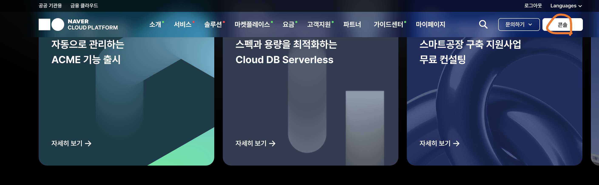
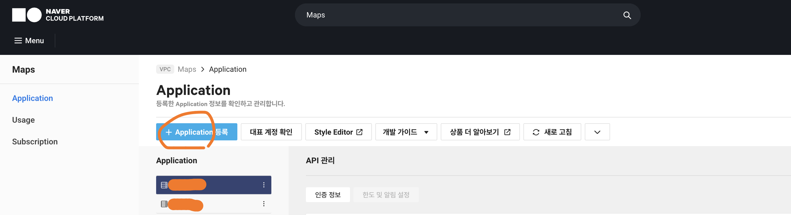
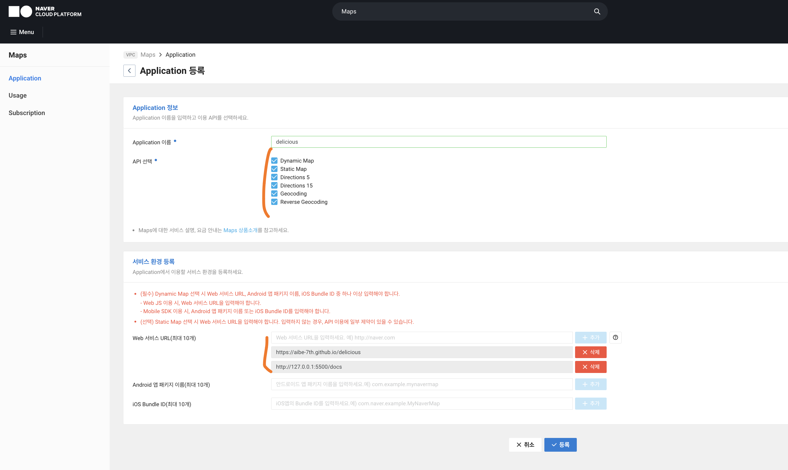
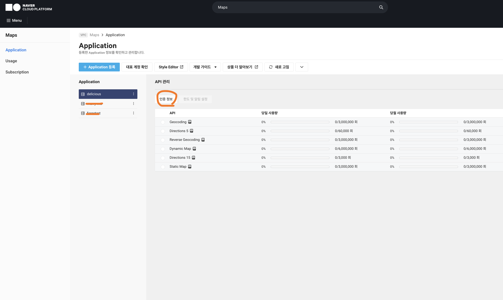
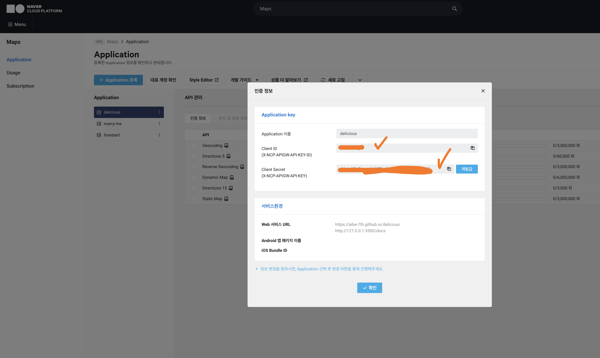

# 지도 검색 설정 (Naver Maps)

- 게시글 작성 시 주소(도로명·지번)로 검색해 좌표(위경도)와 상호명 후보를 받는다.
- 네이버 지역검색 API는 Client Secret이 필요하고 브라우저 직접 호출이 막혀 있어, 정적 호스팅(GitHub Pages)에서는 **네이버 지도 JS SDK의 Geocoding**으로 구현한다.
  - 주소 → 좌표 변환이며, 결과에 건물명이 있으면 상호명 입력란에 자동으로 채운다.
- 키 1개(`ncpKeyId`)만 발급해 `docs/js/config.js`에 넣으면 동작한다. 검색 로직은 `docs/js/place-search.js`에 provider로 분리해 두어 추후 다른 지도 서비스로 교체하기 쉽다.
- 인증 헤더(`X-NCP-APIGW-API-KEY`)나 Client Secret은 **필요 없다.** 그 값들은 서버에서 REST API를 직접 호출할 때만 쓰며, 여기서는 JS SDK가 `ncpKeyId` + 등록한 도메인으로 인증한다.

## 1. NAVER Cloud Platform 접속



- NAVER Cloud Platform에 접속해 로그인한다.
  - https://www.ncloud.com/
- 우측 상단 `콘솔`로 이동한다.
  - https://console.ncloud.com/dashboard

## 2. Maps 서비스 이용 신청



- 콘솔 검색창에 `Maps`를 입력해 `Services > Application Services > Maps`로 이동한다.

## 3. Application 등록



- `Application 등록`을 클릭한다.
- `Application 이름`에 `delicious`를 입력한다.
- `Service 선택`에서 다음 두 가지를 필수적으로 체크한다.
  - `Web Dynamic Map` (선택 위치 미리보기 지도용)
  - `Geocoding` (키워드 → 좌표 변환용)
- `Web 서비스 URL`에 사용할 주소를 등록한다.
  - 로컬 개발 서버 주소 (예시: `http://127.0.0.1:5500`, `http://localhost:5500`)
  - GitHub Pages 주소 (예시: `https://{GitHub 아이디}.github.io`)
- 등록하지 않은 도메인에서는 SDK 인증이 거부되므로 배포 주소를 반드시 추가한다.
- `등록`을 클릭한다.

## 6. 인증 정보(Client ID) 확인




- 등록한 Application의 `인증 정보`에서 `Client ID`를 복사한다.
  - 이 값이 SDK 로딩에 사용하는 `ncpKeyId`이다. (구버전 콘솔에서는 `ncpClientId`로 표기되기도 한다.)

## 7. 프로젝트에 키 입력

- `docs/js/config.js`의 `NAVER_MAP_CLIENT_ID`에 복사한 `Client ID`를 입력한다.

  ```js
  export const NAVER_MAP_CLIENT_ID = "여기에_Client_ID";
  ```

- 저장 후 게시글 작성 페이지에서 `장소 검색`에 주소나 건물명을 입력하고 `검색`을 누른다.
  - 결과 목록(프리뷰)에서 항목을 선택하면 위도·경도가 자동 입력되고, 선택 위치가 미니 지도로 표시된다.
  - 키가 비어 있으면 검색이 비활성화되고 좌표를 직접 입력하는 방식으로 동작한다.

## 한계와 향후 확장

- geocode는 **주소 변환기**라 도로명·지번 주소로만 검색된다. 상호·가게 이름(예: `스타벅스 강남R점`)으로는 검색되지 않는다.
  - 주소 DB에 등록된 유명 건물명(예: `롯데월드타워`)은 간혹 매칭되지만 일반 상호는 불가하다.
  - 네이버는 여기까지(주소 기반 검색)로 마무리한다. 상호명은 사용자가 직접 보정 입력한다.
- 상호 키워드(POI) 검색이 필요해지면 다음 중 하나로 교체한다. 검색 로직이 `place-search.js`의 `searchPlaces` 한 곳에 모여 있어 그 함수만 바꾸면 된다.
  - **네이버 지역검색 API + Supabase Edge Function 프록시**: Secret을 서버에 두고 함수로 중계.
  - **카카오 로컬 키워드 검색**: REST 키만으로 브라우저에서 직접 호출 가능(CORS 허용), 좌표도 WGS84로 바로 사용.
