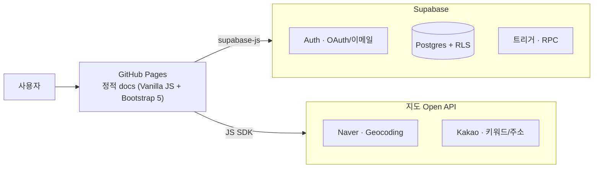
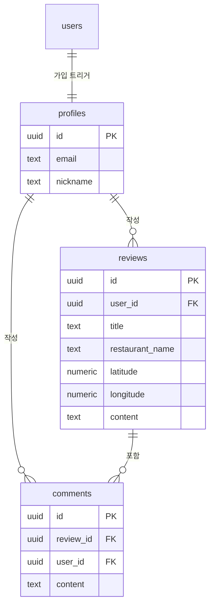
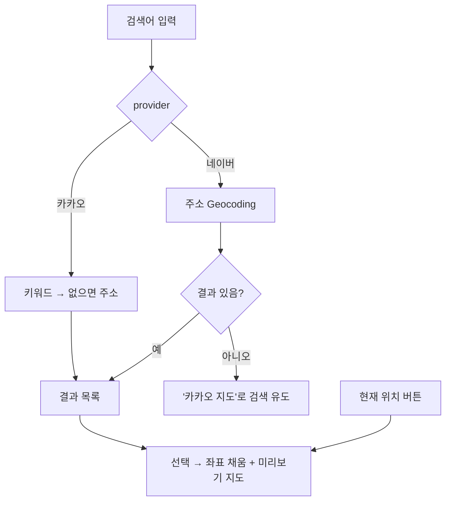

# 🍴 Delicious


맛집 리뷰를 작성하고 지도에서 위치를 확인하는 정적 웹 서비스.

🔗 **Live:** https://aibe-7th.github.io/delicious/

## 핵심 기능

- **인증** — 이메일 회원가입(메일 인증) + 소셜 로그인(Google, Kakao)
- **리뷰** — 맛집 리뷰 작성·수정·삭제와 댓글 (작성자 본인만 수정/삭제)
- **장소 검색** — 네이버(주소)·카카오(상호/주소) 검색으로 좌표 입력, "현재 위치" 지정
- **지도 표시** — 작성 미리보기 + 목록 카드 지도(정보창에 상호명·주소), 한국 범위 밖은 경고 처리
- **보안** — RLS 정책 + 가입 시 프로필 생성 트리거(서버 처리)

## 아키텍처



## 데이터 모델



## 장소 검색 흐름



## 기술 스택

| 구분 | 사용 |
|------|------|
| 프런트 | Vanilla JS(ESM), Bootstrap 5 |
| 백엔드 | Supabase (Auth, Postgres, RLS, 트리거/RPC) |
| 지도 | Naver Maps JS SDK, Kakao Maps JS SDK |
| 호스팅 | GitHub Pages (`docs/`) |

## 프로젝트 구조

```
docs/            정적 프런트엔드 (HTML · js/ · css/)
supabase/schemas 테이블·RLS·트리거 SQL
0N_*.md          외부 서비스 설정 가이드
img/0N/          가이드 캡처
```

## 설정 가이드

- [01_supabase.md](./01_supabase.md) — Supabase 프로젝트·키
- [02_social-login.md](./02_social-login.md) — Google·Kakao 소셜 로그인
- [03_open-api-map.md](./03_open-api-map.md) — Naver·Kakao 지도
